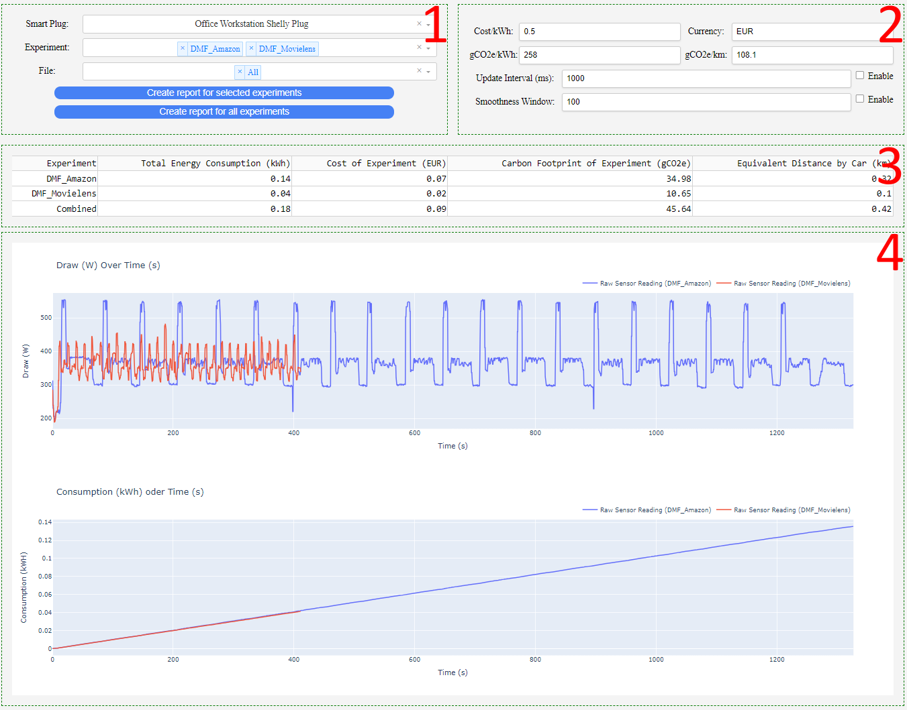

# EMERS: Energy Meter for Recommender Systems

## Table of Contents

- [Introduction](#introduction)
- [Features](#features)
- [Requirements](#requirements)
- [Energy Meter Interfaces](#energy-meter-interfaces)
    - [Supported Devices](#supported-devices)
    - [Setup Instructions for Supported Devices](#setup-instructions-for-supported-devices)
    - [Adding Support for New Devices](#adding-support-for-new-devices)
- [Usage Examples](#usage-examples)
    - [Measuring Energy Consumption](#measuring-energy-consumption)
        - [Continuous Measurement](#continuous-measurement)
        - [Integrated Measurement](#integrated-measurement)
    - [Monitoring and Reporting Energy Consumption](#monitoring-and-reporting-energy-consumption)
        - [Running the Monitoring Interface](#running-the-monitoring-interface)
        - [Using the Monitoring Interface and Creating Reports](#using-the-monitoring-interface)

## Introduction

EMERS is the first software library that measures, monitors, records, and shares the energy consumption of recommender
systems experiments.

EMERS reads and logs energy readings from smart plugs, organizes them based on the associated research experiment,
provides a user interface to monitor and analyze measurements, and creates a standardized, automated report to share
with the community.

## Features

1. A user interface that enables researchers to monitor, visualize, and analyze the energy consumption of their
   experiments interactively.
2. Generate a standardized report of the energy consumption of recommender systems experiments.
3. Measure energy consumption with integrated, per-experiment energy consumption logging through an API.
4. Standalone energy consumption logging in the background.

## Requirements

1. A smart plug that can read and transmit energy consumption data.
   See [Energy Meter Interfaces](#energy-meter-interfaces) for supported devices. Alternatively,
   see [Adding Support for New Devices](#adding-support-for-new-devices) to learn how to add support for a new device.
2. Python 3.10 and the required packages. Install them with `pip install -r requirements.txt`.

---

# Energy Meter Interfaces

The energy meter interfaces are stored in the `meters` folder. They implement an asynchronous
method `get_data_<device_type>(**kwargs)` that reads data from a specific smart plug and returns
a `MeasurementLogResult` object that contains energy measurements.

## Supported Devices

0. [Mock Plug (generates fake data for debugging)](meters/mock_api.py)
1. [Shelly Plug Plus S](meters/shelly_api.py)
2. [TP-Link Tapo P115](meters/tapo_api.py)

## Setup Instructions for Supported Devices

1. Obtain either the Shelly Plug Plus S or the TP-Link Tapo P115 smart plug.
2. Read the manual of the smart plug to find out how to connect it to your Wi-Fi network and perform the initial setup.
   Make sure that the smart plug is connected to the same network as the computer running this software.
3. Open [settings.json](settings.json) and add an entry for the smart plug. The key is the desired identifier of the
   plug. The value should be a dictionary with the following keys:
    1. `device_type`: The type of the device. This must be one of the supported device types.
    2. `device_ip`: The IP address of the plug.
    3. For Shelly Plug Plus S:
        1. `device_id`: The device ID of the plug. This is usually `0` if this is the only Shelly Plug Plus S on the
           network.

       Example settings entry for Shelly Plug Plus S:
          ```json
          "shelly_meter": {
              "device_type": "shelly",
              "device_ip": "192.168.2.1",
              "device_id": "0",
          }
          ```
    4. For TP-Link Tapo P115:
        1. `tapo_user`: The username of the Tapo account that the plug is connected to.
        2. `tapo_password`: The password of the Tapo account that the plug is connected to.

       Example settings entry for TP-Link Tapo P115:
          ```json
          "tapo_meter": {
              "device_type": "tapo",
              "device_ip": "192.168.2.2",
              "tapo_user": "yourname@provider.com",
              "tapo_password": "password",
          }
          ```

## Adding Support for New Devices

1. Choose a name for your new device type. We will refer to this name as `<device_type>`.
2. Add a new file `<device_type>_api.py` in the `meters` directory.
3. Implement an asynchronous function `get_data_<device_type>(**kwargs) -> MeasurementLogResult` in the newly created
   file.
   Document the required keyword arguments that are passed to this function. These must be defined when configuring a
   device of `<device_type>` in `settings.json`.

---

# Usage Examples

## Measuring Energy Consumption

Measuring energy consumption comes in two measurement modes: continuous and integrated.

1. Continuous measurement is designed to be run as a separate Python script. It measures and logs energy consumption
   data
   until stopped. Continuous measurement is implemented in [continuous_measurement.py](continuous_measurement.py).
2. Integrated measurement is designed to be used within code that executes experiments. Integrated measurement is
   implemented in [measurement_manager.py](measurement_manager.py).

### Continuous Measurement

1. To run continuous measurement, execute the following command in your terminal:

    ```bash
     python continuous_measurement.py --device_name <device_name> --polling_rate <polling_rate> --log_interval <log_interval>
    ```

    1. Replace `<device_name>` with the name of the device as specified in `settings.json`.
    2. The default `<polling_rate>` is 0.5 (seconds), e.g., the smart plug is polled twice a second.
    3. The default `<log_interval>` is 300 (seconds), e.g., a new log file is created every 300 seconds.

2. The logs are saved in the `measurements` directory. A new directory is created for each device, and
   continuous measurement logs are saved in a directory named `continuous`.
3. Continuous measurement can be stopped and restarted at any time.

### Integrated Measurement

1. The following Python code is a simplified example of what a recommender systems experiment may generally look like:

    ```python
    from my_functions import load_data, split_data, train_model, evaluate_model

    data = load_data()
    train, test = split_data(data)
    model = train_model(train)
    predictions = model.predict(test)
    evaluate_model(predictions)
    ```

    1. The code snippet assumes that the functions `load_data`, `split_data`, `train_model`, and `evaluate_model` are
       defined elsewhere in the project.

2. Integrated measurement can be added to the code snippet above to log energy consumption data at specific points
   in during execution. For example, to log only the training phase, the code snippet would be modified to look like
   this:

    ```python
    from my_functions import load_data, split_data, train_model, evaluate_model
    from measurement_manager import MeasurementManager
    
    data = load_data()    
    train, test = split_data(data)
    with MeasurementManager(device_name=device_name, experiment_name=experiment_name, polling_rate=polling_rate, log_interval=log_interval) as manager:
        model = train_model(train)
    predictions = model.predict(test)
    evaluate_model(predictions)
    ```   

    1. Replace `device_name` with the name of the device as specified in `settings.json`.
    2. Replace `experiment_name` with the name of the experiment, e.g., `my_algorithm_training`.
    3. The default `polling_rate` is 0.5 (seconds), e.g., the smart plug is polled twice a second.
    4. The default `log_interval` is 300 (seconds), e.g., a new log file is created every 300 seconds.
    5. The `MeasurementManager` class is a context manager that logs energy consumption data during the execution of the
       code block within the `with` statement. It automatically starts measuring and logging when entering the block and
       stops logging when exiting the block, organizing the logs by device and experiment.

3. The logs are saved in the `measurements` directory. A new directory is created for each device, and
   integrated measurements are saved in a directory named `experiment_name`.

## Monitoring and Reporting Energy Consumption

The monitoring interface is a web application that visualizes energy consumption data. It is implemented
in [monitoring_interface.py](monitoring_interface.py).

### Running the Monitoring Interface

1. To start the monitoring interface, execute the following command in your terminal:

    ```bash
    python monitoring_interface.py --ip <ip> --port <port>
    ```
    1. Replace `<ip>` with the IP address of the computer running the monitoring interface. The default is `localhost`.
    2. Replace `<port>` with the port number to run the monitoring interface on. The default is `5000`.

2. The monitoring interface can be accessed in a web browser at `http://<ip>:<port>`.

### Using the Monitoring Interface and Creating Reports

The monitoring interface consists of four major regions. The regions are marked with red numbers in the preview here:



1. **Experiment Selection and Report Generation**: A dropdown menu to select the experiment to monitor and buttons to
   generate an energy consumption report.
    1. There are three dropdown menus: One for the smart plug, one for the experiment, and one for specific log files.
       The selected items will be used to display the energy consumption graph and information.
    2. There are two buttons to generate reports: One for a summary report of the selected experiment and one for
       a detailed report of the whole project.
2. **Cost/Footprint Settings and Graph Settings**: Input fields to set the cost and carbon footprint of energy and to
   toggle live updating and smoothness of the energy consumption graph.
    1. The cost of energy per kWh, its currency, the carbon footprint of energy per kWh in gCO2e, and the carbon
       footprint of a car per km in gCO2e can be adjusted here. The values will be used to calculate the cost and carbon
       footprint of the energy consumption. To persistently modify these settings,
       modify [monitor_settings.json](monitor_settings.json).
    2. Live updating of the graph is disabled by default and can be toggled at any time. The update interval can also be
       configured here.
    3. A smoothed version of each graph can be displayed. This is toggled here and the rolling window size for
       smoothness can be adjusted here as well.
3. **Experiment Information**: Tabular information about the energy consumption the selected experiment.
    1. This table contains information about the energy consumption, cost, and carbon footprint of the selected
       experiment.
4. **Energy Consumption Graph**: A live updating graph of energy consumption.
    1. Two graphs are displayed: One for the energy consumption at specific time stamps (upper) and one for the total
       energy consumption (lower).